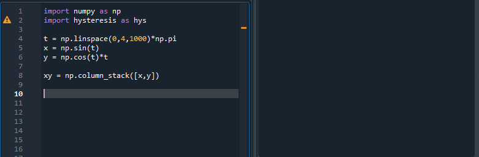

<h1 align = "Left">Hysteresis: Tools for Non-functional curves.</h1>

Hysteresis is a library of tools for non-functional curves, with a emphasis on force-deformation hysteresis curves.
While functions only have one direction, non functional curves change direction, making analyzing them difficult.
Some key features of the library include:

* Finding peaks or reversal points in data.
* Numerically finding the slope or area of a curve.
* Resampling curves.
* Comparing Hysteresis made with simialar load protocols.

## Contents

* [Demo](https://github.com/cslotboom/Hysteresis#demo)
* [Install](https://github.com/cslotboom/Hysteresis#install)
* [Features](https://github.com/cslotboom/Hysteresis#features)
* [Tutorials](https://github.com/cslotboom/Hysteresis#tutorials)

## Basic Demo

A basic demo of the hystresis object. 
Hysteresis can split up a non-function into a number of cycles that are functions.

## Install

Hysteresis is pip installable via:

`pip install hystresis`

## Features

Using Hysteresis, it's possible to 

