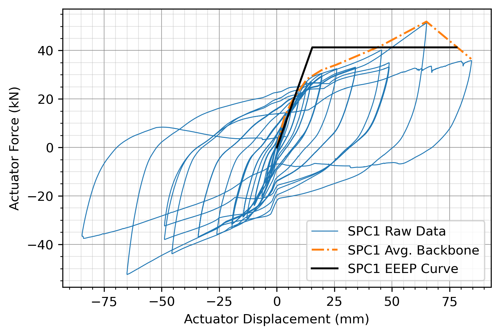
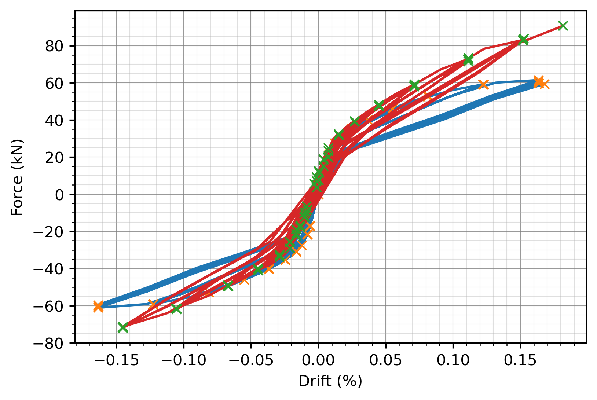
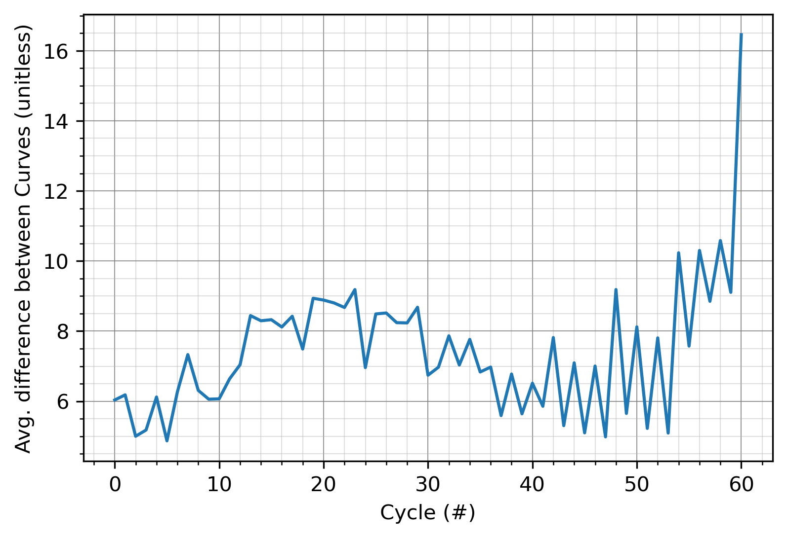

<h1 align = "Left">Hysteresis: Analysis Tools for Non-functional Curves.</h1>

Hysteresis is a Python library made for analyzing non-functional curves, with an emphasis on force-deformation hystereses.
While functions only have one direction, non-functional curves change direction, and each 'x' can be is mapped to more than one 'y'. 
Hysteresis can break up these curves into a number of functions that can be easily analyzed. 


A overview of the functions currently availible to users can be found here: https://hysteresis.readthedocs.io/en/latest/ <br>
Examples can be found here: https://github.com/cslotboom/hysteresis/tree/master/examples


## Contents
* [Basic Demo](https://github.com/cslotboom/Hysteresis#demo)
* [Install](https://github.com/cslotboom/Hysteresis#install)
* [Features](https://github.com/cslotboom/Hysteresis#features)
* [Tutorials](https://github.com/cslotboom/Hysteresis#tutorials)
* [Terminology](https://github.com/cslotboom/Hysteresis#Terminology)

***

## Basic Demo

Hysteresis objects are created by passing a xy curve to one of the base classes.
The resulting object has many useful methods that help with analyzing the data. Here we plot the data, seeing the the reversal points have been detected.

<p align="center">
  
</p>


```python
import numpy as np
import hysteresis as hys

t = np.linspace(0,4,1000)*np.pi
x = np.sin(t)
y = np.cos(t)*t
xy = np.column_stack([x,y])

myHys = hys.Hysteresis(xy)
myHys.plot(showReversals = True)
```


## Install

Hysteresis is pip installable via:

```python
pip install hysteresis
```

***


## Features

Using Hysteresis, it's possible to:

### Find peaks or reversal points in data:
Using a Hysteresis object, it's possible to find the reversal points in your data, and break curves up into a series of "SimpleCycles" that are all functions.
Experimental data is often messy, and the Hysteresis package comes with a number of ways to filter the peaks of data.

Filtering peaks in data:
<p align="center">
  
</p>


Finding reversal points in data ([Ex. 2.1](https://github.com/cslotboom/hysteresis/blob/master/examples/02%20Basic%20Usage/2.1%20Basic%20Seismic%20Damper/2.1%20Basic%20Seismic%20Damper.py)):
<p align="center">
  
</p>


### Easily display data
All Hysteresis objects come with built in plotting functionality, built off matplotlib. It's possible to plot a variatety of features about the curve, and make publication ready plots.

```
fig, ax = plt.subplots()
line = myHys.plot(showReversals=True)
ax.set_xlabel('Actuator Displacement (mm)')
ax.set_ylabel('Applied Force (kN)')
```

### Find the backbone of a hysteresis
Using the Hysteresis module, it's possible to find the backbone of a hysteresis, then fit a curve to that data.  ([Ex. 3.2](https://github.com/cslotboom/hysteresis/blob/master/examples/03%20Find%20Backbone%20of%20Experimental%20Data/3.2/3.2%20-%20SPC1%20-%20EEEP.py)).
Data provided by Dr. Thomas Tannert of UNBC: Drexler M, Dires S, Tannert T (2021), "Internal perforated-steel-plate connections for CLT shear walls.", In proceedings of World Conference for Timber Engineering, Santiago de Chile. 

<p align="center">
  
</p>


### Find the area or slope of a hysteresis:
If the area or slope has been set it's possible to return the slope or area of a curve. Assuming your units are correct, the area under each hysteresis curve is the energy contained by the curve!

```
area = myHys.area
netArea = myHys.getNetArea()
cumulativeArea = myHys.getCumArea()
slope = DamperHys.slope
```

<p align="center">
  
</p>

### Down sample a hysteresis:
It's also possible to reduce the number of points in a curve, using the resample functions. These functions use linear interpolation to make a new curve with less data points than the original.
<p align="center">
  
</p>


### Compare two hystereses:
If two hystereses have the same load protocol, the hysteresis package allows you to "compare" the curves. This operation will take two hystereses, resample them, then find the average "difference" between each point on the curve. 
<p align="center">
  
</p>

<p align="center">
  
</p>

***
## Tutorials
Youtube tutorials coming soon.

***
## Terminology

A **curve** is a sequence of xy points, i.e. [xy0, xy1, ..., xyN]

Portions of a **curve** will have a **direction** in both **x** and **y**, depending on if values are increasing or decreasing.
The **direction** of a **curve** section depends on the overall curve trends, and small imperfections in the data can be ignored.
Points where the x values change direction are called **reversal points**.
Points where the y values change direction are called **peaks**.

The Hysteresis package has a number of objects to represent curves with different properties

The most basic type of curve is the **MonotonicCurve**.
**onotonicCurves** do not change direction in x or y.
They have two **revesal points**, and two **peaks** (the first and last point for both)


Next are **SimpleCurves**. These are curves where x does not change direction, but y can.
They will have two **reversal points** (the first and last point), and multiple **peaks**.
Between peak points, they can be broken into a number of **"Subcycles"** represented by of **MonotonicCurves**.


Finally, a **Hysteresis** is a **curve** where that changes direction in both the x and y.
They can have any number of **reversal points** and **peaks**.
The Hysteresis are broken into a number of **cycles** between reversal points. These **cycles** are represented by a **SimpleCurve**.


